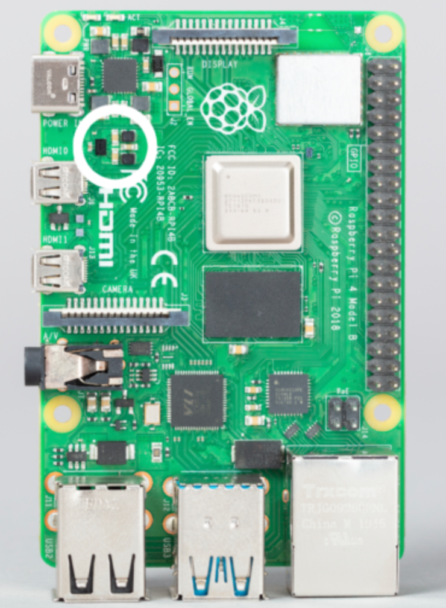
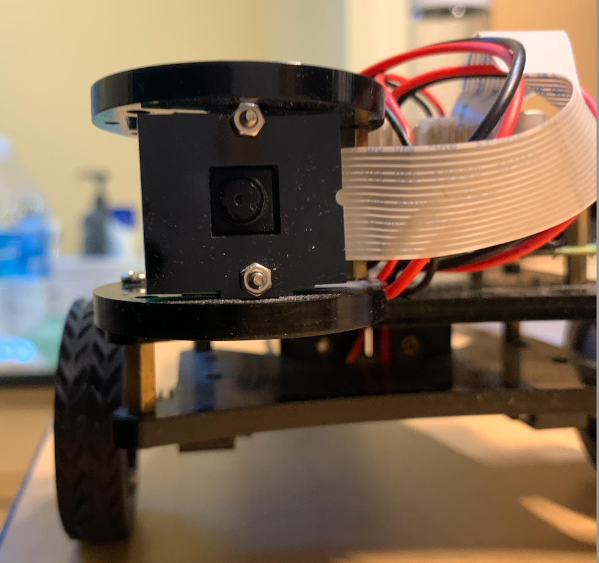
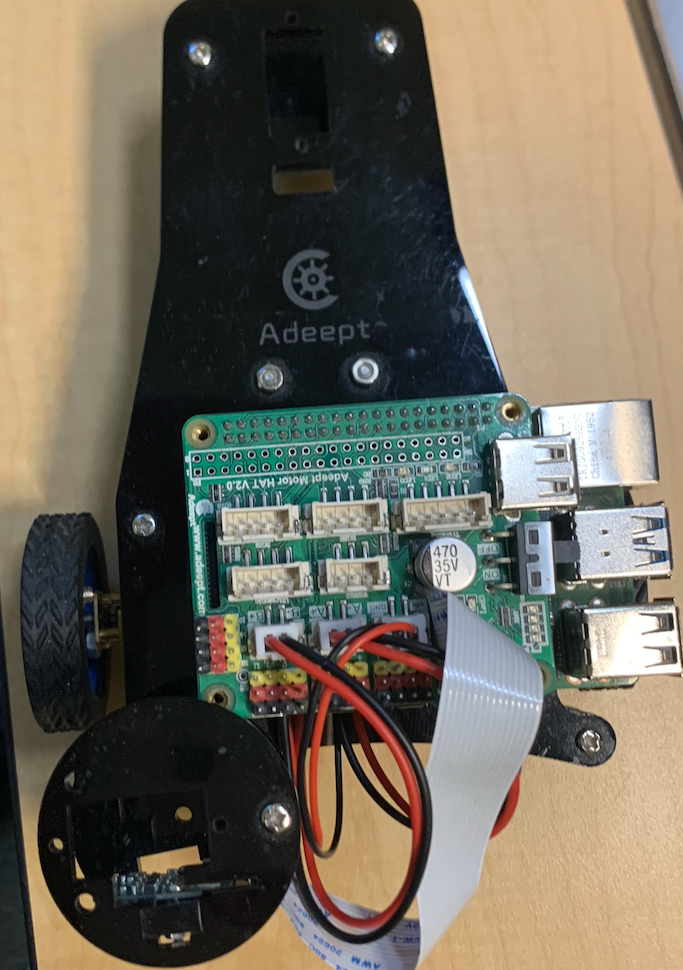
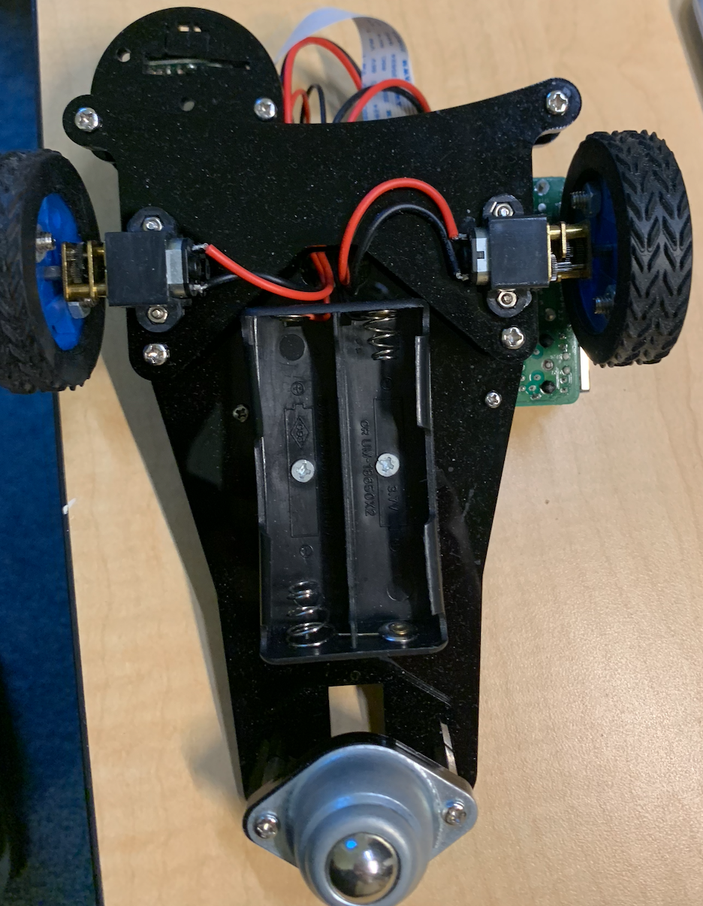

## Overview

This project focuses on developing end to end fully functional AI-driven autonomous robot car. The project is base on 

## Project Structure
```plaintext
Car_Line_Tracking/
│
├── src/
│   ├── car_AI_load_model.py              
│   ├── Motor.py    
│   ├── car_AI_Run.py  
│   ├── car_AI_train.py
│   └── car_data_capture.py  
│                         
├── models/
│   └── car_drive.h5
│ 
├── DIR/
│   ├── a/
│   ├── d/
│   ├── w/
│   ├── s/
│   └── READEM.md	# Project data collection instructions
│ 
└── README.md		# Project overview and instructions
```

## Requirements

- Python 3.7+
- opencv
- RPi.GPIO

You can install the necessary packages using the following command:

```bash
pip install opencv-python 
```

## How to Run

### 1. Run Line Tracking 

Run car with one cmd:

```bash
python src/car_AI_Run.py
```
### 2. Hardware	
#### Control Board
Raspberry pi 4 B:<br>


Adeept Motor Hat V2:<br>


#### Robot Car
Robot car front:<br>


Robot car top:<br>


Robot car bottom:<br>


## Results
AI self driving:


## Next Steps
- **AI Model Deploy :**
 Experiment with neural network architectures to improve car self drive performance.
- **End-to-End AI System :**
Consider exploring end-to-end learning approaches where a neural network directly controls the robot based on raw camera input.
- **Reinforcement Learning :**
Experiment with reinforcement learning to further advance your project into a more complex AI-driven system.

## Contributing
Contributions are welcome! Please fork the repository and create a pull request to contribute to the project.

## License
This project is licensed under the MIT License.
